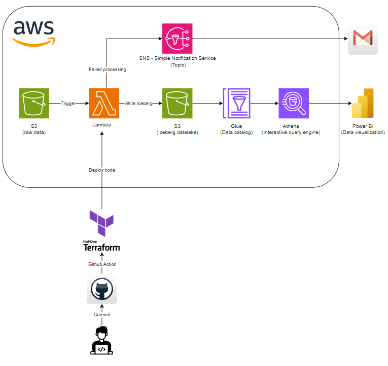

# AWS Lambda by Terraform Project

Project to spin up AWS services by following this flow:



- [AWS Lambda Terraform Project](#aws-lambda-terraform-project)
  - [Project structure](#project-structure)
    - [Python structure](#python-structure)
    - [Terraform structure](#python-structure)
  - [Setup](#setup)
    - [Creating & Configuring User for Terraform deployment in the AWS IAM](#create-user)
    - [Deploy AWS SDK for Pandas](#cdeploy-aws-sdk-pandas)
    - [Configuring credentials in Terraform](#config-credentials-in-terraform)
  - [Provision](#provision)
    - [Terraform Init](#terraform-init)
    - [Terraform Validate](#terraform-validate)
    - [Terraform Plan](#terraform-plan)
    - [Terraform Apply](#terraform-apply)
  - [CI/CD Pipeline](#pipeline)
  - [Result](#result)

## Prerequisites

* [AWS account](https://aws.amazon.com/vi/free/)
* [Terraform](https://developer.hashicorp.com/terraform/tutorials/aws-get-started/install-cli)
* [Git version >= 2.37.1](https://github.com/git-guides/install-git)

## Project structure

In this project we have two main folder: `src` for Python code and `terraform` for Terrafrom configuration file

### Python structure

In this repo we will use Python 3.11 ([AWS Function Python config](./terraform/modules/lambda/main.tf#L143))

Lambda has [pre-installed](https://gist.github.com/gene1wood/4a052f39490fae00e0c3) Python library like boto3,.. If you need to install other library, you need to create layer and attach it to Lambda. In this repo, we will put light library into [requirements.txt](./src/requirements.txt) and create layer zip file by this script (you need to make sure this zip file doesnot exceed 250MB when extracting) and then create & attach layer to Lambda by Terrafrom. For large library like awswrangler or Machine Learning library, you can install AWS managed layer from [application](https://serverlessrepo.aws.amazon.com/applications) and then attach to Lambda

This function will transform csv file in S3 ([sample csv](./assets/retail_data.csv)) and write data to Iceberg table in Athena 

`src` folder structure:

```bash
.
├── src
│     ├── helpers                    
│     │   ├── __init__.py
│     │   ├── logging_helper.py
│     │   └── config.py
│     ├── main.py     # Entrypoint for Lambda function            
│     └── requirements.txt  # Contains the list of Python packages
```

### Terraform structure

We will provisioning some AWS resources by using [Terraform](https://developer.hashicorp.com/terraform/tutorials/aws-get-started), we also put Terraform file in separated module folder for each resources:

* [Lambda](./terraform/modules/lambda): Provisioning Lambda Function and some resources for it
* [S3 Notification](./terraform/modules/s3_notification): Provisioning S3 notification so after file was created in S3, a event will be fired and it contains metadata about this file and then Lambda will be triggered by this event
* [Simple Notification Service](./terraform/modules/sns): SNS topic and [email](./environments/variables.tfvar#L10) subcription for failed processing 

```bash
└── 
    environments
    │   ├── backend.tfvars          # Terafrom backend config (Resource group -> Storage Account -> container)
    │   └── terraform.tfvars.json   # Terafrom values for variables
    terraform
    ├── backend.tf                  # Terafrom backend config state file

    ├── main.tf
    ├── modules
    │   ├── lambda
    │   │   ├── main.tf
    |   │   ├── outputs.tf
    │   │   └── variables.tf
    │   ├── s3_notification
    │   │   ├── main.tf
    │   │   └── variables.tf
    │   ├── sns
    │   │   ├── main.tf
    |   │   ├── outputs.tf
    │   │   └── variables.tf
    ├── provider.tf
    └── variables.tf
```

## Setup

In order to run the project you'll need to preprare the credential for Terraform to provisioning resources in AWS

### Creating & Configuring User for Terraform deployment in the AWS IAM

Terraform offer some of ways to get it, in this project we will authenticate AWS using a credentials (Acess Key & Secret Key) of User

First, you need to create a User in IAM and create credentials (Acess Key & Secret Key) of this User

Second, you need to grant AdministratorAccess permission for this User so Terraform can create resources in AWS 

### Deploy AWS SDK for Pandas

This Lambda function uses [AWS SDK for Pandas](https://aws-sdk-pandas.readthedocs.io/en/stable/) library as layer, but this library is a large package and exceeds 250MB limit of layer if we put `awswrangler` into [requirements.txt](./src/requirements.txt) to create layer so you need to pre-deployed this [application](https://serverlessrepo.aws.amazon.com/applications/us-east-1/336392948345/aws-sdk-pandas-layer-py3-11) into Lambda layer because Terraform doesn't support for this deployment. Then you retrieve ARN of the layer and replace this [variable](./environments/variables.tfvar#L11) with the ARN of layer

### Configuring credentials in Terraform

After you create Service Principal and get credentials, you can export these credentialsto environement variables like this:

```bash
export AWS_ACCESS_KEY_ID="00000000-0000-0000-0000-000000000000"
export AWS_SECRET_ACCESS_KEY="00000000-0000-0000-0000-000000000000"
```

## Provision

We will run Terraform command to create resources in AWS
 
### Terraform Init
Initialize Terrafrorm AWS Provider and Module, we will use S3 to act as backend which storage Terraform state file, this [backend config](./environments/backend.tfvars)

```bash
cd terraform
```

```bash
terraform init -backend-config ../environments/backend.tfvars
```

### Terraform Validate

Validate code syntax

```bash
terraform validate
```

### Terraform Plan

Plan resouces which will create by Terraform, we storage Terraform variable config in this [file](./environments/variables.tfvars) and export `planfile.tfplan` file

```bash
terraform plan -out planfile.tfplan -var-file ../environments/variables.tfvars
```

### Terraform Apply

Finally, we will apply above `planfile.tfplan` file

```bash
terraform apply -auto-approve planfile.tfplan
```

## CI/CD Pipeline

We also set up a simple [Github Action workflow](./.github/workflows/pipeline.yml) to deploy services to AWS

## Result

Function App Functions:


We can see `requirements.txt`, `host`, etc in App File (Azure Portal) like this:


Environment Variables:

